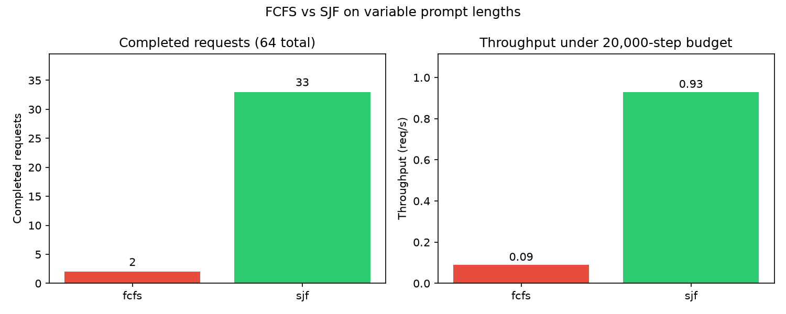

# How shortest-job-first improves throughput under variable prompt lengths

This case study shows how a one-line scheduling change can dramatically improve throughput when prompt lengths vary and the batch token budget is tight.

## The scenario

Imagine a chat API that accepts requests with very different prompt sizes:

- Some users send short prompts: 64 tokens.
- Other users paste long documents: up to 1024 tokens.
- The serving engine can process at most 512 tokens per step.
- New requests arrive at 4 requests per second.

Under FCFS (first-come-first-served), a long prompt that arrives early monopolizes the batch budget. Shorter prompts that arrive later must wait, even though they could have been served quickly. This is classic *head-of-line blocking*.

## Chunked prefill

A 1024-token prompt does not fit in one 512-token step, but it does not need to. The simulator supports *chunked prefill*: prompts larger than the per-step token budget are processed incrementally across multiple prefill steps. A 1024-token prompt therefore requires at least two 512-token prefill steps before decoding can begin.

Because the budget is tight, scheduling decisions matter. FCFS spends multiple steps on the first long request it sees, while shorter requests pile up behind it.

## Workload config

The config `examples/case_study_variable.yaml` captures this scenario:

```yaml
name: variable-prompt-case-study
scheduler: fcfs
cache_policy: no_op
workload:
  name: variable
  generator: variable
  num_requests: 64
  arrival_rate: 4.0
  prompt_tokens_min: 64
  prompt_tokens_max: 1024
  output_tokens_min: 16
  output_tokens_max: 128
  seed: 42
engine:
  name: simulation
  max_tokens_per_step: 512
max_steps: 20000
output_dir: ./inferarena_outputs/case_study_variable
```

Key knobs:

- `max_tokens_per_step: 512` creates the tight budget.
- `prompt_tokens_max: 1024` creates requests that require chunked prefill.
- `generator: variable` produces the prompt-length spread.
- `seed: 42` makes the workload deterministic.

## Running the comparison

Compare FCFS against shortest-job-first (SJF):

```bash
inferarena compare --config examples/case_study_variable.yaml \
  --schedulers fcfs,sjf
```

## Results

Under the fixed 20,000-step budget:



| Metric | FCFS | SJF |
|---|---|---|
| Completed requests | 2 | 33 |
| Unfinished requests | 62 | 31 |
| Completion rate | 3.1% | 51.6% |
| Throughput (rps) | 0.09 | 0.93 |
| TTFT p50 (ms) | 23.30 | 38.55 |
| Latency p50 (ms) | 1457.90 | 1595.15 |

SJF completes **16.5× more requests** and achieves **10.3× higher throughput** than FCFS within the same execution budget.

## Interpreting latency percentiles

TTFT and latency percentiles above are calculated only over *completed* requests. Because FCFS completes just two requests, its latency and TTFT percentiles are not directly comparable to SJF's. The apparently lower FCFS latency is affected by severe survivorship bias: the metric ignores the 62 requests that never finished.

The main result of this experiment is therefore **completion rate and throughput under a fixed execution budget**, not a latency comparison.

## Why this happens

FCFS processes requests in arrival order. When a 1024-token prompt arrives first, it consumes multiple prefill steps before any later request can enter the batch. By the time the long request finishes prefill, many short requests are stuck in the queue and the run ends before they are served.

SJF reorders the waiting queue by estimated job size. Short prompts jump ahead, get through prefill quickly, and free the batch budget for the next short prompt. The long prompts still run, but they no longer block the rest of the queue.

## Trade-offs

The case study is not claiming SJF is universally better.

- **Survivorship bias:** Latency metrics only reflect completed requests. A fair latency comparison would require running both policies until every request finishes or applying a common completion cutoff.
- **Starvation:** Pure SJF can indefinitely delay large requests under sustained arrivals of short requests. A production policy would usually add aging, deadlines, or weighted priorities to balance throughput and fairness.
- **Workload-dependent:** On a uniform workload with equal prompt lengths, FCFS and SJF behave similarly.

## Takeaway

A realistic workload shape plus a constrained batch budget can turn an obvious baseline like FCFS into a poor choice. InferArena makes it trivial to discover this: implement or select a scheduler, run the same workload, and compare completion rate and throughput.

Try it yourself:

```bash
inferarena compare --config examples/case_study_variable.yaml \
  --schedulers fcfs,sjf,chunked_prefill,priority
```
